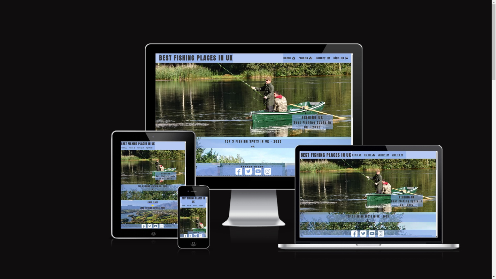
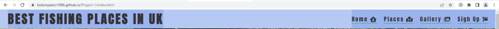
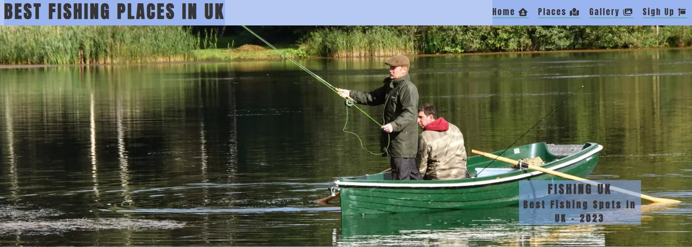
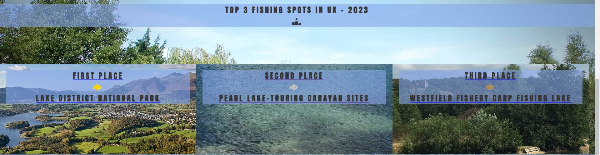
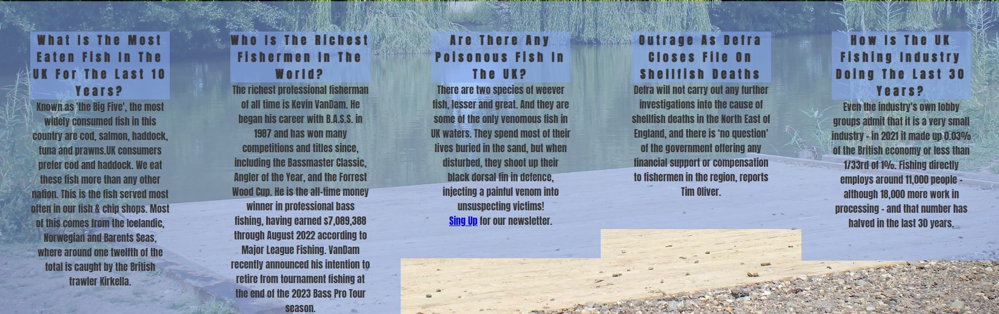
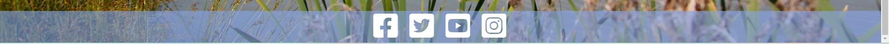

<h1 text-align="center">BEST FISHING PLACES IN UK<h1>

## [View the live project here.](https://todorspasov1986.github.io/Project-1/index.html)

#### This is a fishing places site that is showing and recommending to everyone who wants to go fishing in the UK, which are the top places rated by the other Fishermans. It is designed to be responsive and accessible on a range of devices, making it easy to navigate from mobile phones and tablets.</h4>

<h2 text-align="center"></h2>

## User Experience (UX)

-   ### User stories

    -   #### First Time Visitor Goals

        1. As a first time visitor, I want to easily understand the main purpose of the site and learn more about the fishing places in UK.
        2. As a first time visitor, I want to be able to easily navigate throughout the site to find content and location for places which i can vsisit in the future.
        3. As a first time visitor, I want to find out which are the top recomended fishing places for 2023 . I also want to locate their social media links.

    -   #### Returning Visitor Goals

        1. As a returning visitor, I want to find the latest fishing news.
        2. As a returning visitor, I want to find the locations with short description for the top 5 places in uk so it will be easier for me to plan which one to visit.
        3. As a returning visitor, I want to find a gallery with some of the best fishing images from the places in the site.

    -   #### Frequent User Goals
        1. As a frequent user, I want to have a frequantly updated site on which i will be able to plan my fishing trip.
        2. As a frequent user, I want to check to see if the same places are still voted as top UK fishing destinations.
        3. As a frequent user, I want to sign up to the Newsletter so that I can receive the latest fishing news every week.

-   ### Design
    -   #### Colour Scheme
        -   The two main colours used are rgba(134, 166, 235, 0.6) and rgb(22, 22, 22).
    -   #### Typography
        -   The Anton font is the main font used throughout the whole website with some Labrada in the cover text and Sans Serif as the fallback font in case for any reason the font isn't being imported into the site correctly. Anton is a reworking of a traditional advertising sans serif typeface. The letter forms have been digitised and then reshaped for use as a webfont.

    -   #### Imagery
        -   Imagery is important. The large, background image is designed to be striking and catch the user's attention. The most of the sites background is from different eyes catching photos. On the places page, it has images for the top 5 locations as well. The gallery is created from 14 pictures of different fishing catches from the top  places in UK. 

 
## Features 

### Existing Features

- __Navigation Bar__

  - Featured on four pages, the full responsive navigation bar includes links to the Logo, Home page, Places, Gallery and Sign Up page and is identical in each page to allow for easy navigation.
  - This section will allow the user to easily navigate from page to page across all devices without having to revert back to the previous page via the ‘back’ button. 

- __The landing page image__

  - The landing includes a photograph with text overlay to allow the user to understand exactly the purpose to this site. 
  - This section introduces the user to Fishing UK and its purpose to present the Best Fishing Places in Uk for 2023, with an eye catching animation to grab their attention.

- __TOP 3 FISHING SPOTS IN UK - 2023__

  - Top 3 Fishing Spots section will allow the user to see which are the Top 3 Fishing spots in UK for 2023, voted from the other fishermans. 
  - This user will find Pictures of the top 3 places aranged from First to Third with links leading to the places section. 

- __NEWS SECTION__

  - This section will provide the user with the 5 latest fishing news. 
  - This section will be updated weekly in line with the sites news letter to keep the user up to date. 

- __The Footer__ 

  - The footer section includes links to the relevant social media sites for Best fishing Places In UK. The links will open to a new tab to allow easy navigation for the user. 
  - The footer is valuable to the user as it encourages them to keep connected via social media.
  - The footer is sticky and it's always displayed at the bottom of the screen viewport. 

- __Gallery__
  - The gallery will provide the user with supporting images to see some of the biggest catches from the top loactions in UK. 
  - This section is valuable to the user as they will be able to see what fish were caught in these locations. 

- __Places__
  - The Places will provide the user with Images, short description and a link for the location from google maps. 
  - In this Section, the user will see the top 5 places in uk and will be able to choose from the best suited for the fishing trip and the location. 

- __The Sign Up Page__

  - This page will allow the user to get signed up to receive the weekly newsletter. The user will be asked to submit their full name, email address, 
  date of birth, where he prefers to fish ( sea, lake, or river), and to leave a short feedback for the site.
  - Next to the signup button it will have a clear button in case the user inputs the wrong information.

- __Thank you__

   - After the user successfully provides all of his requires sign-in detalis he will be transfer to a Thank you page with all the nav bar and footer elements.

### Features Left to Implement

- Will have 15 more fishing places with text and google maps locations
- Will have 5 more news in the news section with  the latest newsletter available as well.
  

## Testing 

### Manual testing 
   - Open the site from several different mobile devices, tablets, laptops, and desktop PCs, and all working and displaying as expected
   - Features testing
     - Navigational bar: All nav bar elements clicked and tested in Chrome, Internet Explorer, and Mozilla Firefox.
     - Top 3 Section: The three Places links are tested and direct the user to the places page.
     - News Section: Signup Link tested and direct the user to the signup page.
     - Footer: Footer elements are tested in Chrome, Internet Explorer, and Mozilla Firefox and open the links in new blank pages.
     - Places page: All 5 links are opening in a new blank page and displaying the correct google maps locations.
     - Sign up form: The form tested on all available browser , user needs to enter all the form inputs excluding the Feedback textarea and then is directed to the Thank you page.
  

### Validator Testing 

- HTML
  - Home page: No errors were returned when passing through the official W3C validator
  
  - Places page: No errors were returned when passing through the official W3C validator
  
  - Gallery page: No errors were returned when passing through the official W3C validator
  
  - Sign up page: No errors were returned when passing through the official W3C validator
  
  - Thank you page: No errors were returned when passing through the official W3C validator
  
- CSS
  - No errors were found when passing through the official W3C (Jigsaw) validator
  
- LightHouse testing : All accessibility passed with 100%
  - Home page
    - Desktop 
     
    - Mobile 
     
  - Places Page
    - Desktop 
     
    - Mobile
     
  - Gallery Page
    - Desktop
     
    - Mobile
     
  - Sign Up Page
    - Desktop
     
    - Mobile
     
  - Thank you Page
    - Desktop
     
    - Mobile
     

### Unfixed Bugs

No Unfixed bugs in the current version of the site

## Deployment
 
- The project was deployed to GitHub Pages using the following steps...

   - Log in to GitHub and locate the [GitHub Repository](https://github.com/)
   - At the top of the Repository (not top of page), locate the "Settings" Button on the menu.
   - Scroll down the Settings page until you locate the "GitHub Pages" Section.
   - Under "Source", click the dropdown called "None" and select "Master Branch".
   - The page will automatically refresh.
   - Scroll back down through the page to locate the now published site [link](https://github.com) in the "GitHub Pages" section.

The live link can be found here - https://todorspasov1986.github.io/Project-1/index.html

## Credits 

### Content 

- The most of the structure and code was taken from Code Insitute learning content (Coffee coders and Love Running Projects)
- The icons in the nav bar ,Top 3 section and footer were taken from [Font Awesome](https://fontawesome.com/)
- The text for the News Section :
   - First news was taken from https://www.sustainablefoodtrust.org : [Link to the News](https://sustainablefoodtrust.org/news-views/sustainable-seafood-uk/#:~:text=Known%20as%20'the%20Big%20Five,%2C%20haddock%2C%20tuna%20and%20prawns.)
   - Second news was taken from https://en.wikipedia.org : [Link to the News](https://en.wikipedia.org/wiki/Kevin_VanDam)
   - Third news was taken from https://www.wildlifetrusts.org : [Link to the News](https://www.wildlifetrusts.org/wildlife-explorer/marine/fish-sharks-skates-and-rays/lesser-weever-fish#:~:text=There%20are%20two%20species%20of,painful%20venom%20into%20unsuspecting%20victims!)
   - Forth news was taken from https://fishingnews.co.uk : [Link to the News](https://fishingnews.co.uk/news/outrage-as-defra-closes-file-on-die-offs/#:~:text=23rd%20February%202023&text=Defra%20will%20not%20carry%20out,the%20region%2C%20reports%20Tim%20Oliver.)
   - Fifth news was taken from https://www.theneweuropean.co.uk : [Link to the News](https://www.theneweuropean.co.uk/so-long-and-thanks-for-all-the-fish-brexit/)
- The text for the Places page:
   - First place was taken from https://en.wikipedia.org : [Link to the description](https://en.wikipedia.org/wiki/Lake_District#:~:text=A%20popular%20holiday%20destination%2C%20it,kilometres%20(912%20sq%20mi).)
   - Second place was taken from https://www.visitherefordshire.co.uk : [Link to the description](https://www.visitherefordshire.co.uk/discover/pearl-lake-country-holiday-park)
   - Third place was taken from https://westfieldfishery.co.uk : [Link to the description](https://westfieldfishery.co.uk/)
   - Forth place was taken from  https://www.willerby.com : [Link to the description](https://www.willerby.com/blog/lifestyle/top-nine-uk-fishing-spots)
   - Fifth place was taken from  https://www.willerby.com : [Link to the description](https://www.willerby.com/blog/lifestyle/top-nine-uk-fishing-spots)

### Media

- The photos used on the home page are from:
   - Main Photo was taken from https://www.northyorkshirewaterpark.co.uk : [Link to the photo](https://www.northyorkshirewaterpark.co.uk/wp-content/uploads/2021/05/17091755a-1600x900.jpeg) 
   - The First Place photo was taken from https://en.wikipedia.org :[Link to the photo](https://upload.wikimedia.org/wikipedia/commons/thumb/a/ab/Keswick_Panorama_-_Oct_2009.jpg/1200px-Keswick_Panorama_-_Oct_2009.jpg)
   - The Second Place photo was taken from https://www.trip.com :[Link to the photo](https://youimg1.tripcdn.com/target/0ww6t120008zg1rd08099.jpg?proc=source%2Ftrip)
   - The Third Place photo was taken from http://westfieldfishery.co.uk :[Link to the photo](http://westfieldfishery.co.uk/wp-content/uploads/2015/07/home-header-image1.jpg)
   - The Backgrond photo was taken from https://crowgreen-fishery.co.uk :[Link to the photo](https://crowgreen-fishery.co.uk/wp-content/uploads/2015/05/Car-park-1.jpg)
- The images used for the gallery page were taken from :
   - Photo 1 was taken from www.stephens-scown.co.uk: [Link to the photo](https://www.stephens-scown.co.uk/app/uploads/2021/11/GettyImages-827888510.jpg)
   - Photo 2 was taken from www.en.wikipedia.org : [Link to the photo](https://upload.wikimedia.org/wikipedia/commons/thumb/0/0e/Angler_at_devizes_england_arp.jpg/300px-Angler_at_devizes_england_arp.jpg)
   - Photo 3 was taken from www.media.wired2fish.com : [Link to the photo](https://media.wired2fish.com/uploads/2023/02/bass-fishing-basics-768x432.webp)
   - Photo 4 was taken from www.www.seaangler.co.uk : [Link to the photo](https://www.seaangler.co.uk/wp-content/uploads/sites/3/cotwweb.jpg)
   - Photo 5 was taken from www.ctfassets.net : [Link to the photo](https://images.ctfassets.net/pujs1b1v0165/2AvtJ9pcEJ4bjxkR8Vc5bJ/5d1033f3c8f450f73cf54b521bb06b4e/How_to_Find_the_Right_Depth_for_Bass.jpg?w=1300&fit=fill&fm=webp)
   - Photo 6 was taken from www.news.sky.com : [Link to the photo](https://e3.365dm.com/22/11/1600x900/skynews-giant-goldfish-carp_5974274.jpg?20221122082215 )
   - Photo 7 was taken from www.media.npr.org : [Link to the photo](https://media.npr.org/assets/img/2022/12/05/bk-87_custom-b15f886a4bc51e70e12ac79d0f6cb5a2ac2202f0-s1300-c85.webp)
   - Photo 8 was taken from www.static.wixstatic.com : [Link to the photo](https://static.wixstatic.com/media/1e31fd_55d0f8ea703b45b8a1c0525c0b74c2bd~mv2.jpg/v1/crop/x_0,y_75,w_3024,h_3046/fill/w_360,h_360,al_c,q_80,usm_0.66_1.00_0.01,enc_auto/9.jpg)
   - Photo 9 was taken from www.farlows.co.uk : [Link to the photo](https://www.farlows.co.uk/media/amasty/blog/cache/h/o/1100/600/how-to-fish-for-salmon.jpg)
   - Photo 10 was taken from www.static.wixstatic.com : [Link to the photo](https://static.wixstatic.com/media/a5d390_26147445d1d24f76a7c234e198118b43.png/v1/fill/w_663,h_491,al_c,lg_1,q_85,enc_auto/a5d390_26147445d1d24f76a7c234e198118b43.png)
   - Photo 11 was taken from www.static.wixstatic.com : [Link to the photo](https://static.wixstatic.com/media/a5d390_0c498307747f42e4ace6a87c1371df99~mv2.jpg/v1/fill/w_784,h_692,al_c,q_85,usm_0.66_1.00_0.01,enc_auto/a5d390_0c498307747f42e4ace6a87c1371df99~mv2.jpg)
   - Photo 12 was taken from /www.fishingtackleandbait.co.uk : [Link to the photo](https://www.fishingtackleandbait.co.uk/Images/Homepages/Grid2022/webp/Warehouse-Clearence.webp)
   - Photo 13 was taken from www.talkseafishing.co.uk : [Link to the photo](https://www.talkseafishing.co.uk/wp-content/uploads/2020/08/garfish-body-shot-1-930x620.jpg)
   - Photo 14 was taken from www.static.wixstatic.com : [Link to the photo](https://static.wixstatic.com/media/1cf8fa_6940017ac1f14b8097eaad763ffb4409~mv2.jpg/v1/fill/w_978,h_342,q_90/1cf8fa_6940017ac1f14b8097eaad763ffb4409~mv2.jpg)
- The photo used on the Signup page is from www.sandwichlakes.co.uk: [Link to the photo](https://www.sandwichlakes.co.uk/wp-content/uploads/2016/03/victory_fishing_lake_sandwich_kent.jpg)
- The photo used on the Thank you up page is from www.wallpaper.dog :[Link to the photo](https://wallpaper.dog/large/10736616.jpg)

### Read me File

- For the Readme file i used the sample tamplates Readme.md for Love Running and Code institute.

### Acknowledgements

-   My Mentor for continuous helpful feedback.

-   Tutor support at Code Institute for their support.

-   January 2023 slack group for their support and advices on our weekly calls